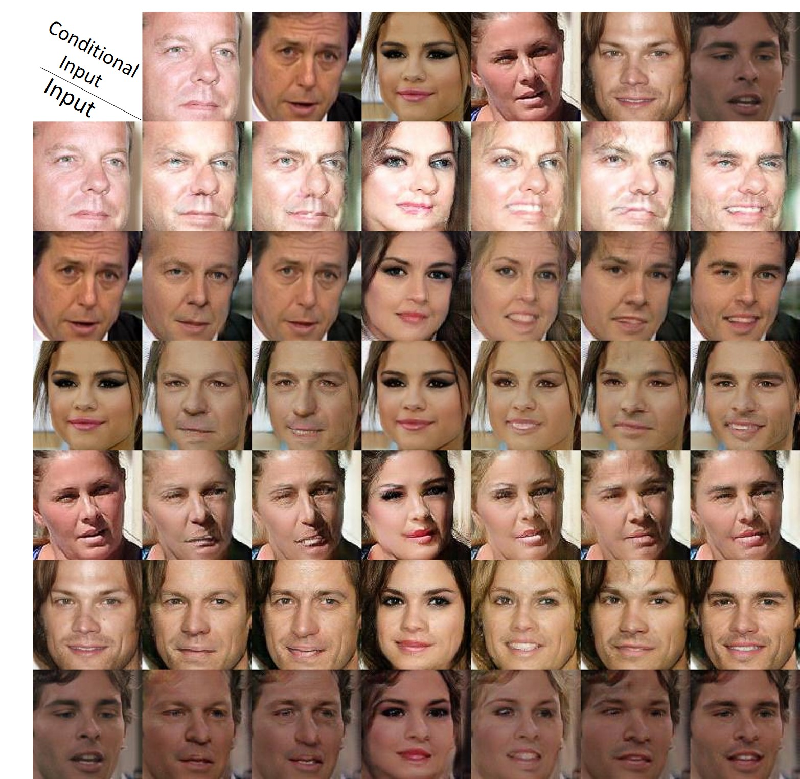
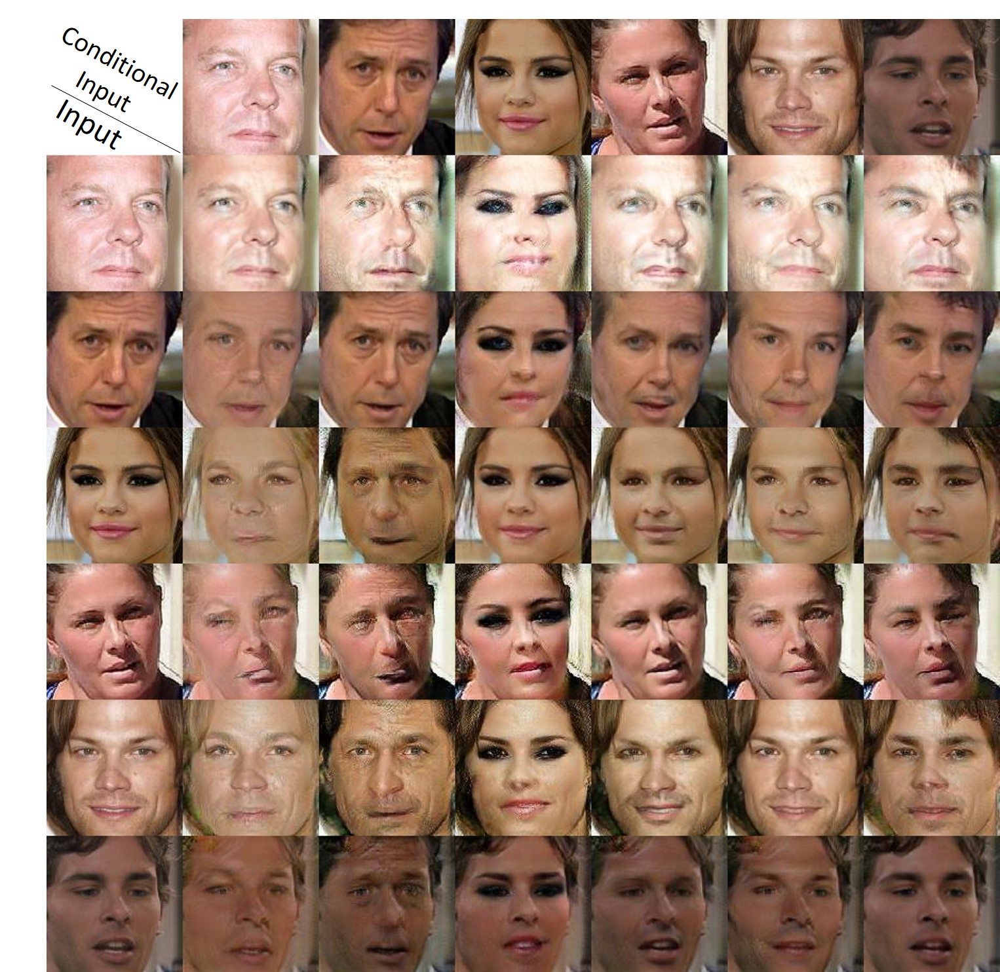
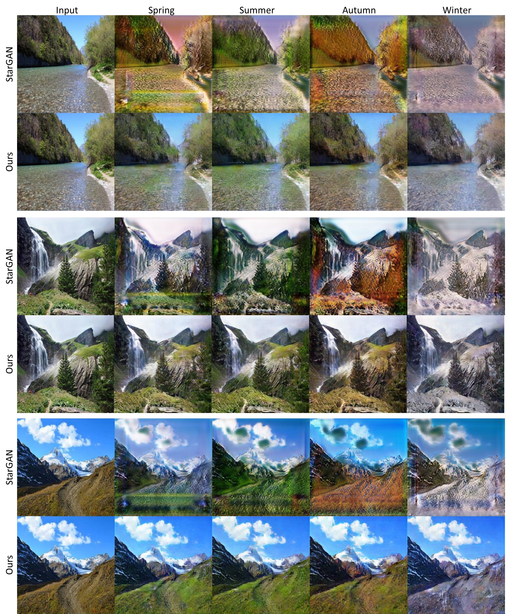

# DosGAN-PyTorch
PyTorch Implementation of [Exploring Explicit Domain Supervision for Latent Space Disentanglement in Unpaired Image-to-Image Translation](https://arxiv.org/abs/1902.03782).

# Dependency:
Python 2.7

PyTorch 0.4.0

# Usage:
1. Downloading Facescrub dataset following http://www.vintage.winklerbros.net/facescrub.html, and save it to `root_dir`.

2. Splitting training and testing sets into `train_dir` and `val_dir`: 

   `$ python split2train_val.py root_dir train_dir val_dir`

3. Train a classifier for domain feature extraction and save it to `dosgan_cls`:

   `$ python main_dosgan.py --mode cls  --model_dir dosgan_cls --train_data_path train_dir --test_data_path val_dir`

4. Train DosGAN:

   `$ python main_dosgan.py --mode train  --model_dir dosgan --cls_save_dir dosgan_cls/models --train_data_path train_dir --test_data_path val_dir`

5. Train DosGAN-c:

   `$ python main_dosgan.py --mode train  --model_dir dosgan_c --cls_save_dir dosgan_cls/models --non_conditional false --train_data_path train_dir --test_data_path val_dir`

6. Test DosGAN:

   `$ python main_dosgan.py --mode test  --model_dir dosgan_c --cls_save_dir dosgan_cls/models --train_data_path train_dir --test_data_path val_dir`
   
7. Test DosGAN-c:

   `$ python main_dosgan.py --mode test  --model_dir dosgan_c --cls_save_dir dosgan_cls/models --non_conditional false --train_data_path train_dir --test_data_path val_dir`
   
   For other kinds of dataset, you can place train set and test set like:

       data
       ├── YOUR_DATASET_train_dir
           ├── damain1
           |   ├── 1.jpg
           |   ├── 2.jpg
           |   └── ...
           ├── domain2
           |   ├── 1.jpg
           |   ├── 2.jpg
           |   └── ...
           ├── domain3
           |   ├── 1.jpg
           |   ├── 2.jpg
           |   └── ...
           ...

       data
       ├── YOUR_DATASET_val_dir
           ├── damain1
           |   ├── 1.jpg
           |   ├── 2.jpg
           |   └── ...
           ├── domain2
           |   ├── 1.jpg
           |   ├── 2.jpg
           |   └── ...
           ├── domain3
           |   ├── 1.jpg
           |   ├── 2.jpg
           |   └── ...
           ...
        
8. Giving multiple season translation for example ([season dataset](https://github.com/AAnoosheh/ComboGAN)). Train a classifier for season domain feature extraction and save it to `dosgan_season_cls`:

   `$ python main_dosgan.py --mode cls  --model_dir dosgan_season_cls --ft_num 64 --c_dim 4 --image_size 256 --train_data_path season_train_dir --test_data_path season_val_dir`

9. Train DosGAN for multiple season translation:

   `$ python main_dosgan.py --mode train  --model_dir dosgan_season --cls_save_dir dosgan_season_cls/models --ft_num 64 --c_dim 4 --image_size 256 --lambda_fs 0.15 --num_iters 300000 --train_data_path season_train_dir --test_data_path season_val_dir`
   
   
 # Results:
 ### 1. Multiple identity translation
 
 **# Results of DosGAN**:
 
  
  
 **# Results of DosGAN-c**:
 
  
  
 ### 2. Multiple season translation:
 
 
